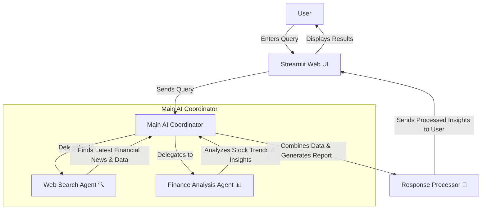

# 📈 Financial Agent  


## 🌟 Overview  

The **Financial Agent** is an AI-powered tool designed to assist users with financial research and analysis. It helps users gather **real-time stock data**, **market insights**, and **financial news** using advanced AI models.  

## 🚀 Features  

- 🔍 **Web Search** – Retrieves the latest financial news from the web.  
- 📊 **Finance Analysis** – Provides stock price trends, analyst recommendations, and financial data.  
- 🖥️ **User-Friendly Interface** – Built using **Streamlit** for an interactive experience.  
- 📚 **Multi-Agent System** – Uses specialized AI agents for different tasks to improve accuracy.  

---

## ❓ Why Multi-Agent?  

Instead of using a **single AI model**, this project follows a **multi-agent approach**. Here’s why:  

✅ **Better Specialization** – Each agent focuses on a specific task (Web Search vs. Stock Analysis).  
✅ **Improved Accuracy** – Instead of mixing tasks, each agent delivers **precise** results.  
✅ **Parallel Processing** – Agents **work together** to provide well-rounded insights faster.  

Example:  
- 🔍 **Web_search_agent** → Searches the latest finance news.  
- 📊 **Finance_agent** → Fetches stock data and fundamentals.  
- 🏆 **Financer Team Agent** → Combines results and presents a final, **clear** answer.  

---

## 🔄 How is this Different from Google Search or ChatGPT?  

| Feature         | Google Search | ChatGPT | Financial Agent |
|----------------|--------------|---------|----------------|
| **Real-Time Data** | ✅ (But raw links) | ❌ (Static data) | ✅ (Live stock prices + news) |
| **Stock Analysis** | ❌ | ❌ | ✅ |
| **Multi-Agent AI** | ❌ | ❌ | ✅ |
| **Formatted Insights** | ❌ | ✅ | ✅ (Structured & data-rich) |
| **Cites Sources** | ❌ | ❌ | ✅ |

💡 **Google Search** gives scattered results. **ChatGPT** cannot fetch live data.  
✅ **Financial Agent combines both** – fetching the latest **news, stock prices, and financial insights** in a structured format.  

---

## 🛠️ Technologies Used  

- **[Phidata](https://phidata.com/)** – Advanced AI modeling  
- **[DuckDuckGo API](https://duckduckgo.com/)** – Web search for finance news  
- **[YFinanceTools](https://pypi.org/project/yfinance/)** – Stock market data  
- **[Streamlit](https://streamlit.io/)** – Interactive UI  
- **Python-dotenv** – Environment variable management  

---

## 🏗️ System Architecture  

This diagram shows how the **Financial Agent** processes user queries using multiple AI agents.  



## Installation

1. **Clone the Repository**:  
   ```bash
   git clone https://github.com/deepakmalikk/Financial_Agent.git
   cd Financial_Agent
2. **Set Up Environment Variables**:
   ```bash
   GROQ_API_KEY=your_groq_api_key_here

3. **Install Dependencies**:
   ```bash
   pip install -r requirements.txt

4. **Run the Application**:
   ```bash
   streamlit run app.py

## 🖥️ Usage
- Open the app in your browser.
- Enter a financial question (e.g., "Latest news on Tesla stock").
- Click “Get Financial Insights” – The AI will fetch results.
- View insights including stock prices, news, and analysis.

## 🚀 Deployment

🔗 Live Demo: [https://financialagent01.streamlit.app/]

## 🤝 Contributing
🙌 Contributions are welcome! Follow these steps to contribute:

1. Fork the repository
2. Create a new branch:
 ```bash
git checkout -b feature-branch
```

3. Make your changes
4. Commit your changes:
```bash
git commit -m "Added a new feature"
```
5. Push to GitHub:
```bash
  git push origin feature-branch
```

6. Create a pull request 🚀

  
## 📜 License
This project is licensed under the MIT License – see the LICENSE file for details.
